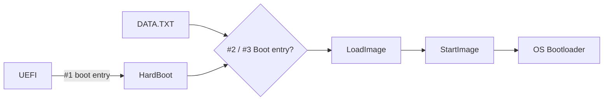

---
title: HardBoot - The hardware boot order switch
date: 2025-10-29 12:00:00 +0100
categories: [Hardware, RP2040, EFI]
tags: [how to, i made a thing]
toc: false
mermaid: true
--- 

## Introduction
I lately brought my Hackintosh install back to life on a new PC that I got about a year ago (Yes, I do not use my Hackintosh very often). The setup is pretty simple, I daily drive Windows so that's obviously installed on an M.2 drive. For the MacOS install I put in a second M.2 so I can dual boot my system. Either starting Windows or MacOS.

Because Windows is my daily driver, the UEFI is configured to simply start the Windows boot manager. Whenever I wanted to boot to MacOS I can interrupt the boot process by pressing the key to open the boot menu, select my other M.2, and boot to that drive. This is usually fine but quite annoying when doing updates of the Hackintosh. It happened more than once that I missed the reboot and my PC booted into Windows. 

What is the solution? Some kind of "persistent" switch that configures my boot sequence. 

## Existing solutions
There are two projects that provide a solution for my problem: [https://hackaday.io/project/179539-hardware-boot-selection-switch](https://hackaday.io/project/179539-hardware-boot-selection-switch) and [https://www.hackster.io/Madrajib/hardware-boot-select-switch-using-pico-a3e3d](https://www.hackster.io/Madrajib/hardware-boot-select-switch-using-pico-a3e3d5). Both use a physical switch to configure your boot order, in my opinion the coolest way to select the OS to boot. The way they work is simple, they simulate a mass storage device with a file. The content of the file changes when we use the physical switch. Then, they configure the GRUB bootloader in a way to choose the appropriate boot entry depending on the content of this file.

Do you see the problem? These projects assume that you are a Nerd running Linux with GRUB. Problem is: I am a Nerd running Windows and MacOS (weird, I know), and I do not have GRUB. I _could_ install GRUB to another EFI partition but I want a solution that is completely independent, so I came up with **HardBoot**.

## The most complex solution
I needed a solution with the following requirements:
- Boot an OS depending on a position of a physical switch
- Work completely independent without modifications to the drives in my PC

My first idea was rather simple. Because one of the project is using a Raspberry Pi Pico, which can simulate a mass storage device over USB, I thought "I could install GRUB just to that!". However, after looking at the complexity of GRUB and the size I quickly scrapped that idea. When simulating a mass storage device using the Pico, you get a maximum size of huge 2,031,616... bytes. About two full Megabytes. That's it.

After looking for other bootloaders that are super simple AND are compatible with my idea, I did not found anything. So I did the next totally reasonable thing:

**_I write my own Bootloader!_**

What a great idea! I have zero experience in how the UEFI works. I have zero experience writing operating systems or bootloaders. I have very little experience in C. What could go wrong?

Apparently quite a lot! But with the help of a dozen different AI assistants I actually managed to write a EFI binary, that an UEFI can boot too, that successfully crashes my system. Wohoo!

Jokes aside, I did manage to come up with a solution that I think is quite genius: **HardBoot** will boot either to the second or third boot entry in the UEFI, depending on the position of the switch. This removes the need of configuring the operating systems (I don't know the plural of OS. OSs? OSes? OSese?), in my bootloader. It will just grab the configuration from the UEFI. The resulting C code for this is just 245 lines, of which 14 are very important ASCII art.

## How does it work?
Now it gets technical! To start some code from the UEFI, we need an EFI binary. An EFI binary is in PE32+ format. Yes, that's basically a Windows executable. To make our lives A LOT easier, we will use the [GNU-EFI](https://wiki.osdev.org/GNU-EFI) library which allows us to use a lot of UEFI APIs. The entry point of our binary looks like this:

```c
EFI_STATUS
EFIAPI
efi_main(EFI_HANDLE ImageHandle, EFI_SYSTEM_TABLE *SystemTable)
{
    Print(ASCII_ART);
    InitializeLib(ImageHandle, SystemTable);
//[...]
```

We will get an EFI_HANDLE and an EFI_SYSTEM_TABLE from the UEFI. So the obvious first step is to print the important ASCII art. Then we can do the less important step of initializing our code.

After some memory and variable initialization we just need a single line to fetch all the configured boot entries in the UEFI:

```c
Status = uefi_call_wrapper(RT->GetVariable, 5, L"BootOrder", &GlobalVar, NULL, &BootOrderSize, BootOrder);
```

Then, we call some code which will read the file `DATA.TXT`, which will be stored next to our EFI binary. Most of this is AI generated but it basically gets the volume where the currently running EFI binary is stored and reads the first byte of the `DATA.TXT` file, if this byte is `0x01`, then the second boot entry will be used later. If it's `0x02`, the third will be used. This value is actually directly used later so `0x03` for using the fourth entry is also possible.

After that, some more `GetVariable()` is used to correctly fetch the selected boot entry and it's stored configuration. When we successfully got it, we can finally switch to that entry. How do we do it? The UEFI allows us to use two _very_ convenient functions: `LoadImage()` and `StartImage()`.

With `LoadImage()`, we are able to, well, load an image. But an image can be in this case another EFI binary. And again very convenient for us, the previous steps just resulted in a path to another EFI binary. After the binary is loaded, `StartImage()` will hand over execution.

Our flow now looks like this:



We are able to just hand over execution to another bootloader, depending on the `DATA.TXT` 🥳

Quick note here: Compiling the C code to an PE32+ binary was a nightmare. Ended up using WSL with an awful amount of compiling arguments. The GitHub repo contains Makefiles for everything so you don't have to suffer.

## The "Product"

Now that our bootloader is complete, we still need the physical switch and a way to change the `DATA.TXT`. Luckily, this is the easy part thanks to an awesome GitHub repo: [usb-rom](https://github.com/sergev/usb-rom). It includes everything to make a RP2040 Zero (The board I will use) appear as an mass storage device. We can simply flash a FAT12 partition (Because we only have 2 MB of space) to a specific region of the RP2040 Zero. This partition will contain two files: `/EFI/BOOT/BOOTX64.EFI`, our compiled PE32+ executable, and `/DATA.TXT`, our dynamic boot choosing file. 

After some trial and error I found the location on the partition, where the `DATA.TXT` is stored and this is where the magic happens: We just replace the content when a device reads this file. The code snipped for this is rather simple:

```c
uint32_t special_lba = (0x10015800 - (uint32_t)DISK_BASE) / DISK_BLOCK_SIZE;
if (lba == special_lba) {
    // Provide your own data instead of reading from flash
    uint8_t *buf = (uint8_t *)buffer;
    for (uint32_t i = 0; i < bufsize; i++) {
        bool gpio_state = gpio_get(15);
        buf[i] = gpio_state ? 0x01 : 0x02;
    }
    return bufsize;
}
```

First, we define our `special_lba`, which is the block where the `DATA.TXT` is stored. Next, if this block is getting read, we fill the entire block with either `0x01` or `0x02`, depending on the state of GPIO15, where the physical switch is connected. Why the entire block and not just that one byte? I don't know. This works, don't touch it.

When plugging in the RP2040 Zero with the code and the flashed partition image we can see the contents we are expecting:

```
PS > tree /F
D:.
│   DATA.TXT
└───EFI
    └───BOOT
            BOOTX64.EFI
```

And when looking at the content of the `DATA.TXT` we can also see the value `0x01`:

```
PS > Format-Hex -Path .\DATA.TXT

           00 01 02 03 04 05 06 07 08 09 0A 0B 0C 0D 0E 0F

00000000   01                                               .
```

We flip the switch and... wait. We run the same command again and still get `0x01`... is something wrong? No, you just experienced Windows weird caching! If you open the file using a proper hex editor like winhex, you will actually see the value change.

With a little bit of 3D printing I can also attach the switch to my monitor for convenient access.

{: .w-75 .shadow }
_The physical HardBoot switch_

## Assembling the pieces

Now we have everything: Our own bootloader, a physical switch, and a device that we can boot to.

By doing so, we are greeted with beautiful ASCII art:

{: .w-75 .shadow }
_HardBoot in action_

You can also already see the `Welcome to GRUB!` message because I actually used GRUB as the second bootloader while testing, it works the same with Windows and MacOS. 

After the project was finished and I configured my mainboard's UEFI to use the **HardBoot** as the first boot entry, Windows as the second and MacOS as the third, my PC boots into Windows just as expected. But I flip the switch, reboot the PC and now I am in MacOS. And even when updating my Hackintosh, my PC still boots into MacOS until I flip the switch again. Success!

If you want to replicate this, everything is documented in the GitHub repo: [https://github.com/blitzdose/HardBoot](https://github.com/blitzdose/HardBoot), I also added the binary files as a release so you don't have to suffer compiling the code, simply flash the two images (The RP2040 Zero code and the FAT12 image) and you have a **HardBoot** of you own.

## Credits
I want to list a few great resources I used during development:

- [The OSDev.org Wiki](https://wiki.osdev.org)
- [The OSDev.org Forum](https://forum.osdev.org)
- The extremely usable [UEFI Specification](https://uefi.org/specs/UEFI/2.10/) (This was the best documentation for anything I ever used)
- [usb-rom project](https://github.com/sergev/usb-rom)
- [This song](https://posy.bandcamp.com/track/guacamole) (Had to include it, check out [Posy](https://www.youtube.com/@PosyMusic), great videos, has absolutely nothing to do with this blog post)

## Final thoughts

Absolutely fun project. Learned a lot of new stuff about UEFI and the boot process a PC has to go through. Also, this is far from finished. I didn't waste a thought about security features like Secure Boot at all, my code probably has a lot of bugs, and booting to entries which I added manually doesn't work for some reason. I only managed to get the entries to work which Windows, Linux, etc. configure for you.

Anyways, if you got any questions just write a comment and I will try to help!

{: .shadow}

See u next time

Christian